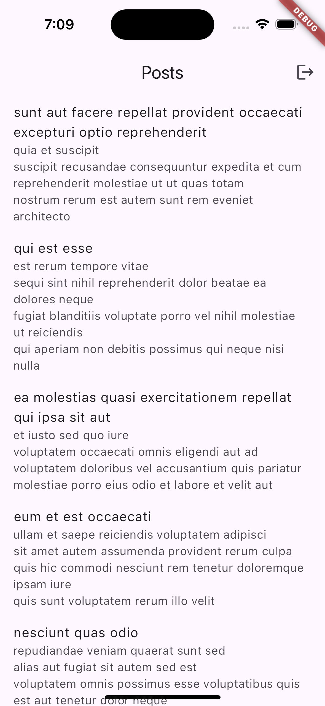

# flutter-firebase-auth-implementation

Este repositorio contiene un proyecto desarrollado en Flutter que implementa la autenticación de usuarios utilizando Firebase como servicio Backend. Además de la autenticación, se exploran otras funcionalidades clave de Firebase para la creación de aplicaciones seguras y eficientes.

## Objetivos

### 1. Bases de Datos Locales en Flutter

- **Comprender cómo utilizar bases de datos locales en Flutter** para almacenar y recuperar datos de manera eficiente.

### 2. Almacenamiento Seguro

- **Aprender a implementar almacenamiento seguro** para proteger información sensible en aplicaciones Flutter.

### 3. Mejores Prácticas para la Persistencia de Datos

- **Aplicar las mejores prácticas** para manejar la persistencia de datos, garantizando la integridad y seguridad de la información.

### 4. Implementación de Autenticación con Firebase

- **Aprender a implementar autenticación** en aplicaciones Flutter utilizando Firebase Authentication para gestionar usuarios de manera segura y eficiente.

### 5. Firebase Analytics y Performance Monitoring

- **Comprender cómo utilizar Firebase Analytics y Firebase Performance Monitoring** para analizar el comportamiento de los usuarios y optimizar el rendimiento de las aplicaciones.

## Estructura del Proyecto

El proyecto está estructurado para abarcar todas las funcionalidades mencionadas, integrando la autenticación con Firebase, almacenamiento seguro, bases de datos locales, y herramientas de monitoreo y análisis de Firebase.

- **/lib/models**: Contiene las clases de modelos de datos utilizados en la aplicación.
- **/lib/providers**: Incluye los proveedores de estado y lógica de negocios utilizando patrones como Provider o BLoC.
- **/lib/router**: Manejo de rutas y navegación dentro de la aplicación.
- **/lib/screens**: Pantallas y vistas de la aplicación, como login, registro, y pantallas protegidas.
- **/lib/services**: Servicios de autenticación, bases de datos locales y almacenamiento seguro.

## Imágenes del Proyecto

Aquí puedes ver algunas capturas de pantalla del proyecto en funcionamiento:

 
 
 

## Requisitos

- Flutter SDK
- Cuenta de Firebase
- Conocimientos básicos de Dart y Flutter

## Instalación

1. Clona este repositorio:

   ```bash
   git clone https://github.com/juniiormediina/flutter-firebase-auth-implementation.git
   ```

2. Navega al directorio del proyecto:

   ```bash
   cd flutter-firebase-auth-implementation
   ```

3. Instala las dependencias:

   ```bash
   flutter pub get
   ```

4. Configura Firebase siguiendo las [instrucciones oficiales](https://firebase.google.com/docs/flutter/setup).

5. Ejecuta la aplicación:
   ```bash
   flutter run
   ```
